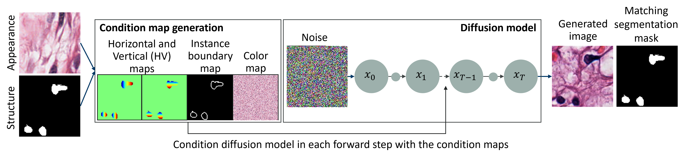
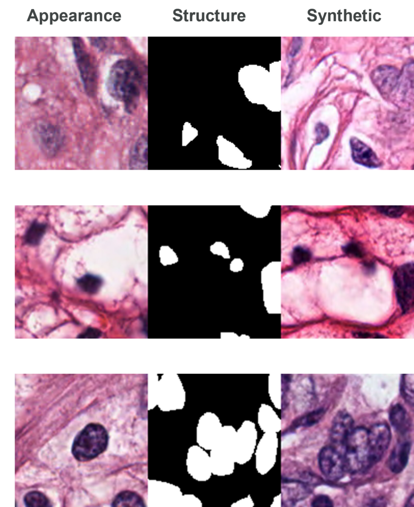
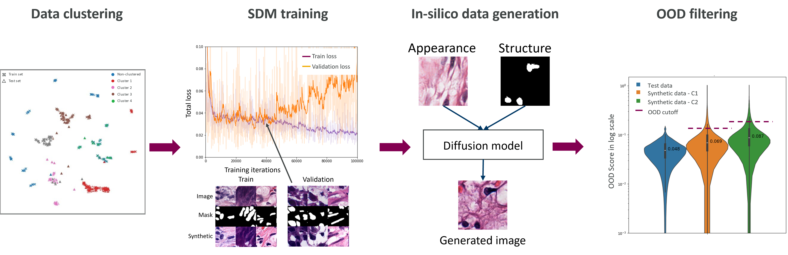

# In-silico image generation through SDM for Nuclei Segmentation

This work extends on [SDM](https://github.com/WeilunWang/semantic-diffusion-model) for histopathological synthetic image generation. 



## Abstract


<!-- # Semantic Image Synthesis via Diffusion Models (SDM)

&nbsp;

  

&nbsp;


&nbsp;

### [Paper](https://arxiv.org/abs/2207.00050)

[Weilun Wang](https://scholar.google.com/citations?hl=zh-CN&user=YfV4aCQAAAAJ), [Jianmin Bao](https://scholar.google.com/citations?hl=zh-CN&user=hjwvkYUAAAAJ), [Wengang Zhou](https://scholar.google.com/citations?hl=zh-CN&user=8s1JF8YAAAAJ), [Dongdong Chen](https://scholar.google.com/citations?hl=zh-CN&user=sYKpKqEAAAAJ), [Dong Chen](https://scholar.google.com/citations?hl=zh-CN&user=_fKSYOwAAAAJ), [Lu Yuan](https://scholar.google.com/citations?hl=zh-CN&user=k9TsUVsAAAAJ), [Houqiang Li](https://scholar.google.com/citations?hl=zh-CN&user=7sFMIKoAAAAJ), -->

<!-- Nuclei segmentation is a crucial task in histopathological image analysis and is essential for cancer diagnosis and treatment planning. Many approaches aim to automate this process using machine learning models, which typically require extensive amounts of data for training. However, data collection and annotation are often expensive,
time-consuming, and demand expertise in histopathology. Recent advances in diffusion models offer a solution by generating synthetic images to expand the size, diversity, and richness of datasets, thus improving the performance of downstream models and mitigating the challenge of limited annotated data, particularly in medical imaging. -->

This repository provides a PyTorch implemntation for synthetic H&E stained image generation. . It modifies the architecture of the semantic diffusion model for style transfer, enabling the generation of synthetic images with diverse texture and structural information using the MoNuSeg dataset. Experimental results show that training segmentation models on this synthetic dataset improve performance,
yielding a 1.8% increase in F1 score for full-sized datasets and a 7.5% improvement for smaller datasets.

<!-- We provide our PyTorch implementation of Semantic Image Synthesis via Diffusion Models (SDM). 
In this paper, we propose a novel framework based on DDPM for semantic image synthesis.
Unlike previous conditional diffusion model directly feeds the semantic layout and noisy image as input to a U-Net structure, which may not fully leverage the information in the input semantic mask,
our framework processes semantic layout and noisy image differently.
It feeds noisy image to the encoder of the U-Net structure while the semantic layout to the decoder by multi-layer spatially-adaptive normalization operators. 
To further improve the generation quality and semantic interpretability in semantic image synthesis, we introduce the classifier-free guidance sampling strategy, which acknowledge the scores of an unconditional model for sampling process.
Extensive experiments on three benchmark datasets demonstrate the effectiveness of our proposed method, achieving state-of-the-art performance in terms of fidelity (FID) and diversity (LPIPS). -->


## Example Results

<p align='center'>  
  
</p>

<!-- * **Cityscapes:**

<p align='center'>  
  
</p>

* **CelebA:**

<p align='center'>  
  
</p>

* **ADE20K:**

<p align='center'>  
  
</p>

* **COCO-Stuff:**

<p align='center'>  
  
</p> -->

## Prerequisites
- Linux
- Python 3
- CPU or NVIDIA GPU + CUDA CuDNN

## Setup

### Data preparation

Download the data following the instructions in the [MoNuSeg Dataset](https://github.com/suren3141/MoNuSegDataset) repository.

### Steps

<p align='center'>  
  
</p>

The data generation step has 4 stages : 
1. [Feature extraction & Clustering](https://github.com/suren3141/patchcore-inspection/tree/main/src/feature_extractor)
2. SDM Training
3. SDM inference
4. [OOD filtering](https://github.com/suren3141/patchcore-inspection/)

The training and inference steps are described in this section. The other steps are explained in the respective repositories.

### Installation

Build the docker image and then run it as follows.

```shell
docker build -t semantic-diffusion-model -f Dockerfile .

docker run --gpus all --rm -it \
  -v $PATH_TO_DATASET:/mnt/dataset 
  --name patchcore patchcore bash
```

Alternatively install the necessary packages manually without docker by using the [requirements](./requirements.txt) file.

### Training

- The model is pretrained on the entire dataset

```shell
OPENAI_LOGDIR='OUTPUT/SDM-MoNuSeg' \
OPENAI_LOG_FORMAT='stdout,log,csv,tensorboard' \
mpiexec -n 8 python image_train.py \
 --data_dir $training_data --dataset_mode monuseg --image_size 128 \
 --lr 1e-4 --batch_size 8  --attention_resolutions 32,16,8 --diffusion_steps 1000 \
 --learn_sigma True --noise_schedule cosine --num_channels 128 --num_head_channels 32 --num_res_blocks 2 \
 --resblock_updown True --use_fp16 True --use_scale_shift_norm True --use_checkpoint True \
 --num_classes 6 --class_cond False --use_hv_map True --use_col_map True --no_instance False \
 --save_interval 005000
```

- The model is then fine tuned on a single cluster

```shell
OPENAI_LOGDIR='OUTPUT/SDM-MoNuSeg-clus6' \
OPENAI_LOG_FORMAT='stdout,log,csv,tensorboard' \
mpiexec -n 8 python image_train.py \
 --data_dir $training_data_clus6 --dataset_mode monuseg --image_size 128 \
 --lr 1e-4 --batch_size 8  --attention_resolutions 32,16,8 --diffusion_steps 1000 \
 --learn_sigma True --noise_schedule cosine --num_channels 128 --num_head_channels 32 --num_res_blocks 2 \
 --resblock_updown True --use_fp16 True --use_scale_shift_norm True --use_checkpoint True \
 --num_classes 6 --class_cond False --use_hv_map True --use_col_map True --no_instance False \
 --save_interval 005000 --drop_rate .2
```

Refer to the [train.sh](./scripts/train.sh) script for further details.

### Inference

The model is then tested to generate synthetic images

```shell
python image_sample.py \
--data_dir $training_data_clus6 --dataset_mode monuseg --use_train True --image_size 128  \
--shuffle_masks False --match_struct True --match_app False \
--attention_resolutions 32,16,8 --diffusion_steps 1000 \
--learn_sigma True --noise_schedule cosine --num_channels 128 --num_head_channels 32 --num_res_blocks 2 \
--resblock_updown True --use_fp16 True --use_scale_shift_norm True \
--num_classes 6 --class_cond False --use_hv_map True --use_col_map True --no_instance False \
--batch_size 16 --num_samples 1000 \
--model_path $model_path \
--results_path $out_dir --s 1.5
```

Refer to the [sample_single.sh](./scripts/sample_single.sh) script for further details.

### Synthetic set generation

The final synthetic set is generated using multiple combination of guidance scale (s-value), and training iteration points. Refer to the [sample.sh](./scripts/sample.sh) script for further details.

## Citation

Please cite the original [Paper](https://arxiv.org/abs/2207.00050) of SDM if you find this work useful.

<!-- ### Acknowledge
Our code is developed based on [guided-diffusion](https://github.com/openai/guided-diffusion). We also thank "test_with_FID.py" in [OASIS](https://github.com/boschresearch/OASIS) for FID computation, "lpips.py" in [stargan-v2](https://github.com/clovaai/stargan-v2) for LPIPS computation. -->
